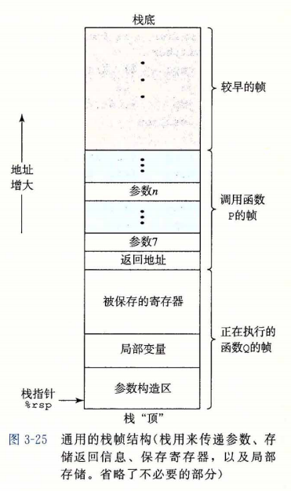

## c语言参数压栈顺序
* 栈帧结构  
  
* 在x86-64下, 第一个到第六个参数存在寄存器中, 第七个参数开始存放在寄存器中, 参数反向压栈, 即第七个参数的地址最小
* 在x86下, 所有函数参数都存放在栈中
* 函数的参数在调用函数P的栈帧中, 在Q运行时, Q只需要分配自己的局部变量和调用函数的参数
* %rbp表示栈底, %rsp表示栈顶
* 为什么这样设计呢? c中有变长参数的函数, 如printf, 如果将第一个参数`FORMAT`存在地址最高处, 则找到`FORMAT`位置需要知道参数个数, 而知道参数个数需要找到`FORMAT`, 因此将`FORMAT`放在地址最低处